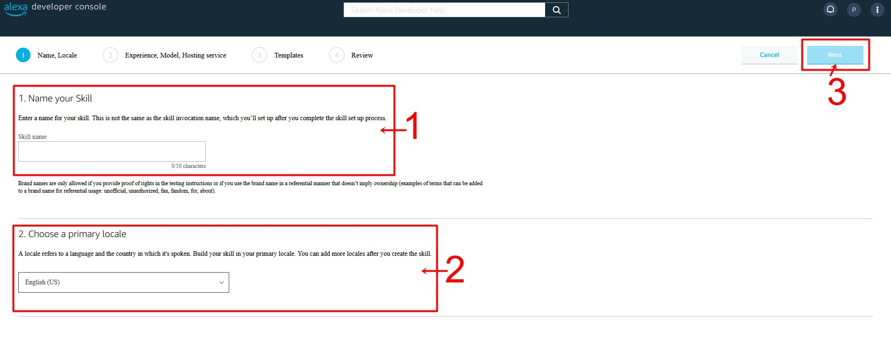
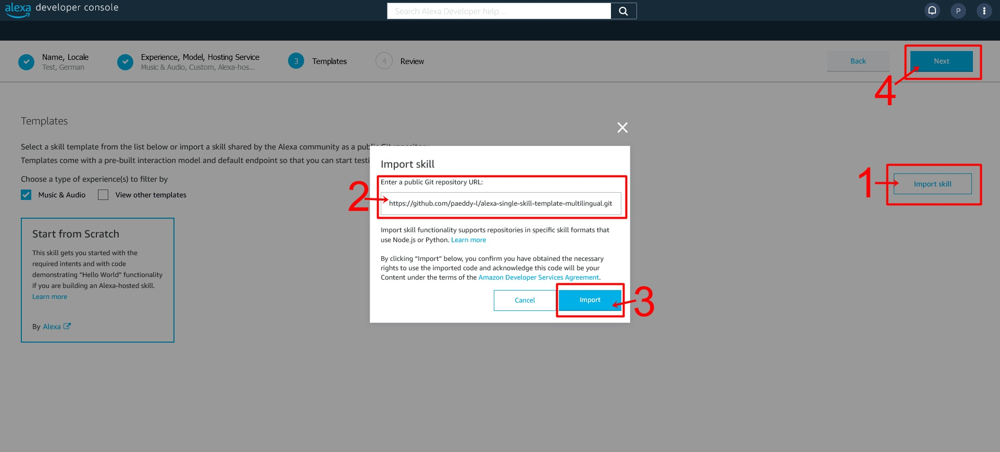
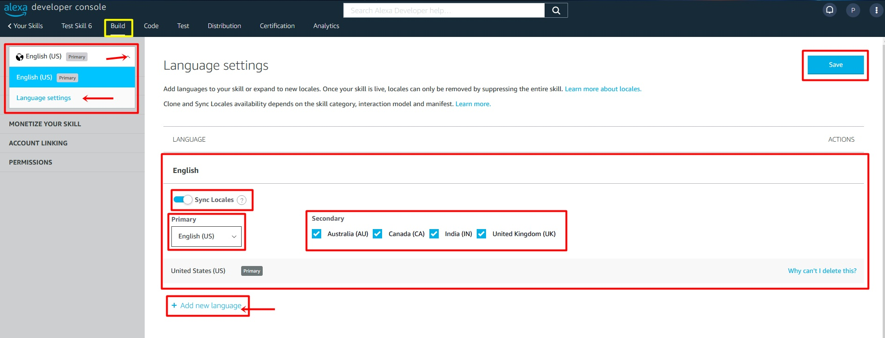
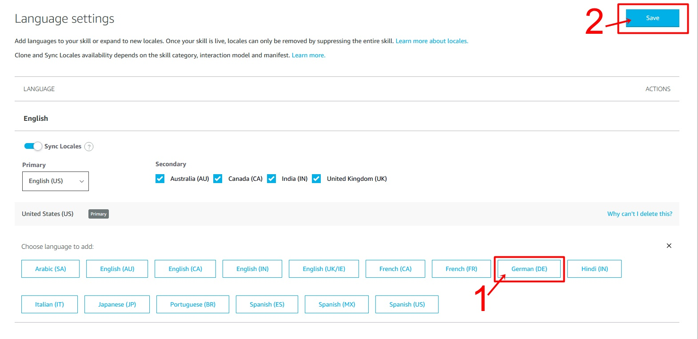
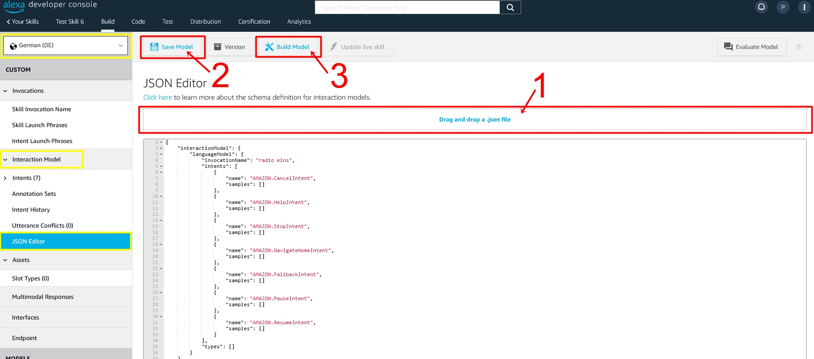
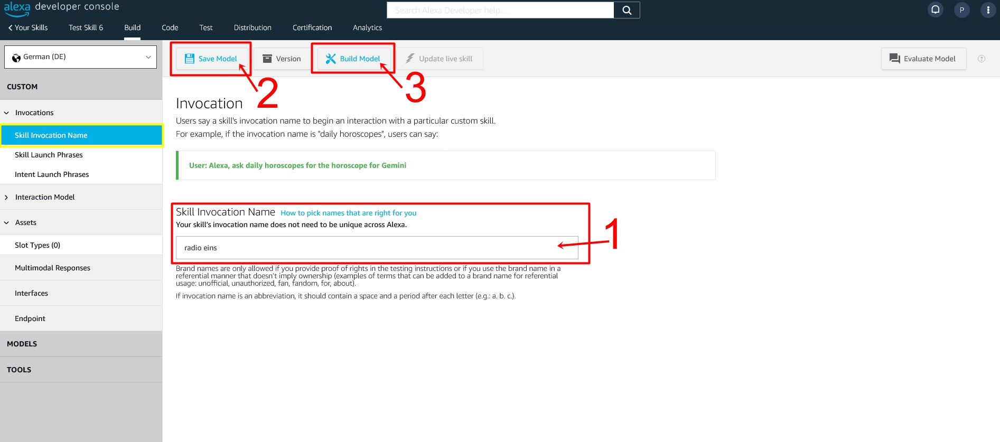
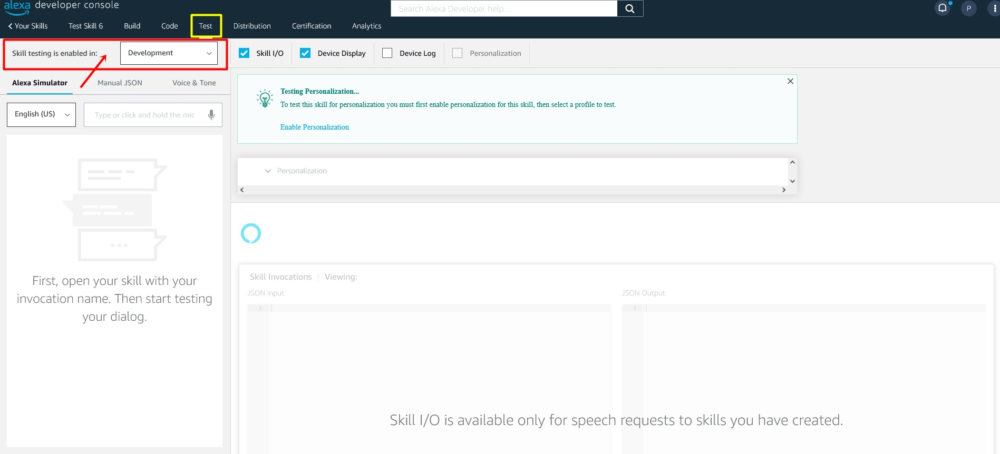
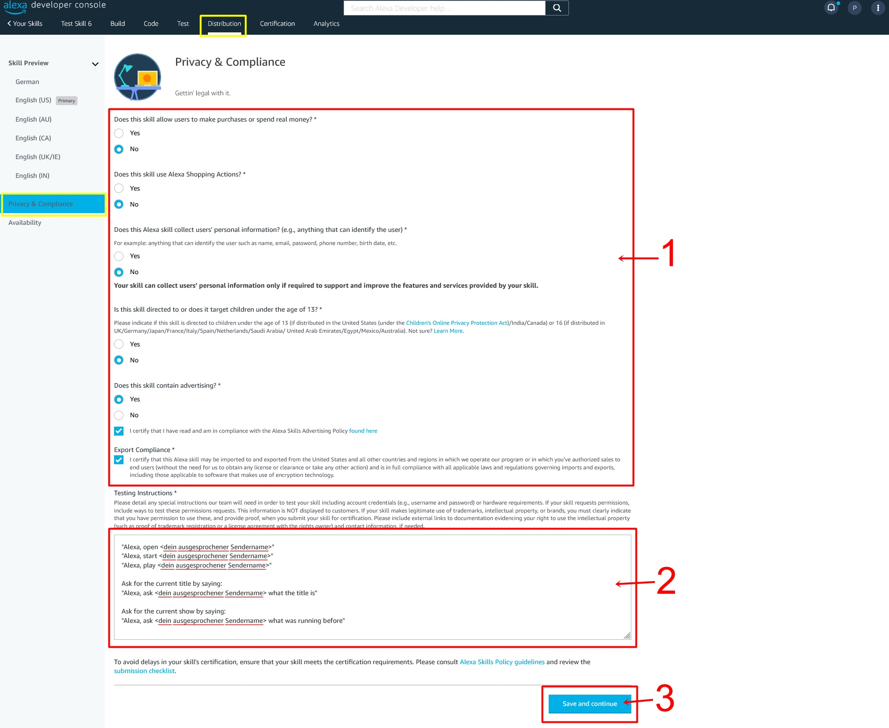

# Mehrsprachiger Single-Skill für laut.fm-Stationen

<details><summary><b>Aktuell unterstützte Sprachen</b></summary>

|     Sprache     |  Länder Code  |     Unterstützt?     |
| --------------- | :-----------: | :-------------------:|
| Arabic (SA)     |    `ar-SA`    |        &#10060;      |
| German (DE)     |    `de-DE`    |        &#10004;      |
| English (AU)    |    `en-AU`    |  &#10004; (en-GB)    |
| English (CA)    |    `en-CA`    |  &#10004; (en-GB)    |
| English (UK)    |    `en-GB`    |       &#10004;       |
| English (IN)    |    `en-IN`    |  &#10004; (en-GB)    |
| English (US)    |    `en-US`    |  &#10004; (en-GB)    |
| Spanish (ES)    |    `es-ES`    |       &#10004;       |
| Spanish (MX)    |    `es-MX`    |  &#10004; (es-ES)    |
| Spanish (US)    |    `es-US`    |  &#10004; (es-ES)    |
| French (CA)     |    `fr-CA`    |       &#10060;       |
| French (FR)     |    `fr-FR`    |       &#10004;       |
| Hindi (IN)      |    `hi-IN`    |       &#10060;       |
| Italian (IT)    |    `it-IT`    |       &#10004;       |
| Japanese (JP)   |    `ja-JP`    |       &#10060;       |
| Portuguese (BR) |    `pt-BR`    |       &#10060;       |

<hr>
</details>

## Anleitung

### Create Skill

1. Logge dich auf <https://developer.amazon.com/alexa/console/ask/> ein (dazu benötigst du ein Konto bei Amazon mit Developer-Registrierung)
2. Klicke auf **Create Skill**
3. Gib den gewünschten Namen unter **Name your skill** ein.
4. Wähle bei **Default language** die Sprache deiner Wahl aus - z.B. **English (US)**
5. Klicke auf **Next**



6. Wähle:
* > **Choose a type of experience** -> **Music and Audio**
* > **Choose a model** -> **Custom**
* > **Hosting services** -> **Alexa-hosted (Node.js)**
* > **Hosting region** -> **EU (Ireland)**
7. Klicke auf **Next**
8. Klicke auf **Import skill**
9. Füge <https://github.com/paeddy-l/alexa-single-skill-template-multilingual.git> im Textfeld ein
10. Klicke auf **Import**
11. Klicke auf **Next**



### Build -> Invocation

1. Gib den Aufruf-Namen unter **Skill Invocation Name** ein.
2. Klicke auf **Save Model**
3. Klicke auf **Build Model**


### Mehr Sprachen hinzufügen

1. Klicke auf **Build** -> Dropdown-Menü -> **Language settings**

Tipp: Bei Englisch wird empfohlen, eine Synchronisierung aller vorhandenen Varianten zu wählen. Als Primäre Sprache ist **English (US)** empfehlenswert

2. Klicke auf **Add new language** und wähle die gewünschte Sprache aus (im Beispiel nehmen wir **German (DE)** [Deutsch]
3. Klicke auf **Save**




<hr>



4. Wähle im Dropdown-Menü die neue Sprache aus, um dort zwingend benötigte Einstellungen zu tätigen
5. Wechsel links zu **interaction Model** -> **JSON Editor**
6. Füge entweder die JSON-Datei der ausgewählten Sprache oder lediglich dessen Inhalt in das dafür vorgesehene Textfeld hinzu <br><a href="https://github.com/paeddy-l/alexa-single-skill-template-multilingual/tree/master/interactionModels/custom" target="_blank">Hier geht es zu den JSON-Sprachdateien</a>



7. Wähle **Skill Invocation Name**, um auch hier einen Aufruf-Namen zu definieren. Achte darauf, dass die Aufruf-Namen an die jeweilige Landessprachen angepasst werden sollten!
8. Klicke auf **Save Model**
9. Klicke auf **Build Model**


10. Jetzt ist der Skill sowohl in Englisch (Primär US-Englisch) als auch in Deutsch verwendbar


### Code

1. Passe `const stationName = "STATIONSNAME"` an
2. Passe `const spokenStationName = "dein ausgesprochener Sendername"` in den verschiedenen Sprachen an
3. Gebe an, ob  Slogan und DisplayName aus der laut.fm-API bezogen werden sollen
4. Wenn bei 3. `false` gewählt wurde, gebe bitte unter **4** & **5** den Slogan / DisplayName für die aktiven Sprachen an
5. Wenn bei 3. `true` gewählt wurde, sind **4** & **5** bedeutungslos
6. Passe bei `const default_language = "en_EN"` ggf. die Standardsprache an


Ersetze `STATIONSNAME` durch den Namen deiner Station - z.B. "eins".
Ersetze `dein ausgesprochener Sendername` mit dem Namen, den Alexa ___sagen___ soll.

7. Klicke auf **Save**
8. Klicke auf **Deploy** 


### Distribution -> Skill Preview -> {language}

Wichtig: Diese Einstellungen müssen für jede Sprache gesondert erstellt werden
Einzige Ausnahme: Synchonisiertes Englisch, in diesem Fall muss nur das primäre Englisch (in meinem Fall English (US)) bearbeitet werden

1. Gib unter **Public Name** den Namen ein, der im Skill-Store angezeigt werden soll
2. Gib eine kurze Beschreibung bei **One Sentence Description** ein
3. Gib eine detaillierte Beschreibung bei **Detailed Description** ein
4. Gib mehrere **Example Phrases** ein, z.B.
```
Alexa, öffne <dein ausgesprochener Sendername>
Alexa, starte <dein ausgesprochener Sendername> 
Alexa, frage <dein ausgesprochener Sendername> wie das Lied heißt
```
5. Lade das **Small Skill Icon** (108x108px PNG oder JPG) hoch
6. Lade das **Large Skill Icon** (512x512px PNG oder JPG) hoch
7. Gib die **Keywords** ein
8. Füge optional bis zu 5 **Detail Page Images** hinzu (1280 x 800px PNG oder JPG)
8. Klicke auf **Save and continue**
9. Wiederhole alles im Schritt **Distribution -> Skill Preview -> {language}** mit allen vorhandenen Sprachen (einzige Ausnahme: Synchonisiertes Englisch, in diesem Fall muss nur das primäre Englisch bearbeitet werden)

### Test
Bitte teste den Skill. Das kannst du mit einem Amazon Echo oder mit der Alexa-App auf deinem Handy. Um den **Development** Skill zu testen, musst du dich mit demselben Amazon-Konto, mit dem du den Skill in der **Developer Console** bearbeitest, auf deinem Test-Gerät einloggen und den Skill zum testen freigeben

1. Klicke auf **Test**
2. Wähle bei **Test is disabled for this skill** -> **Development**
3. Nun kannst du mit Alexa-Geräten oder per Texteingabe den Skill in den verschiedenen Sprachen testen



### Distribution -> Privacy & Compliance

1. Bitte beantworte die Fragen gewissenhaft. Wenn du diese Skill-Vorlage nach Anleitung **ohne zusätzliche Anpassungen** verwendet hast, kannst du die Antworten aus dem unteren Screenshot benutzen.
2. Passe diese Anweisung an und füge sie anschließend bei **Testing Instructions** ein:
```
Start the stream by saying:
"Alexa, open <dein ausgesprochener Sendername>"
"Alexa, start <dein ausgesprochener Sendername>"
"Alexa, play <dein ausgesprochener Sendername>"

Ask for the current title by saying:
"Alexa, ask <dein ausgesprochener Sendername> what the title is"

Ask for the current show by saying:
"Alexa, ask <dein ausgesprochener Sendername> what was running before"
```
3. Klicke auf **Save and continue**




### Certification -> Validation

1. Klicke auf **Run**


2. Bearbeite alle angezeigten Fehler

Wiederhole Schritte 1 und 2,  bis kein Fehler mehr gemeldet wird. Dann kannst du mit dieser Anleitung fortfahren.

### Certification -> Submission

1. Gib eine (optionale) private Versions-Beschreibung bei **Version message** ein.
2. Reiche deinen Skill mit einem Klick auf **Submit for review** ein.


Jetzt musst du warten, bis Amazon deinen Skill bestätigt oder ablehnt. Falls sie den Skill ablehnen, solltest du eine E-Mail mit dem Grund für die Ablehnung bekommen. Wenn du alle Fehler behoben hast, kannst du den Skill erneut einreichen.
